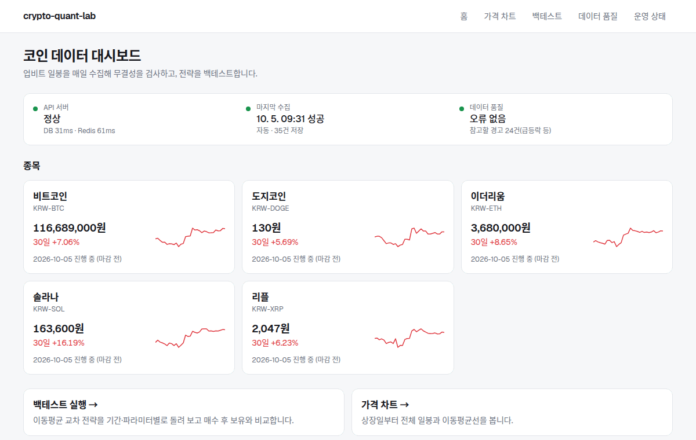
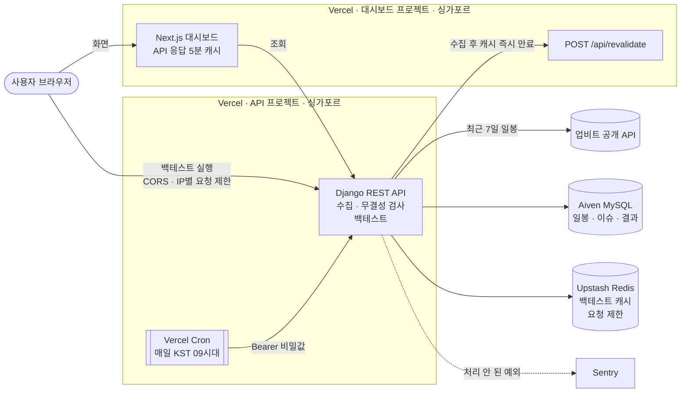

# crypto-quant-lab

업비트 코인 일봉을 매일 수집하고, 데이터 무결성을 검사한 뒤, pandas로 전략을 백테스트해 REST API와 대시보드로 제공하는 프로젝트입니다.

```
업비트 공개 API → 일봉 수집(매일 Cron) → 무결성 검사 → pandas 백테스트 → DRF API (+ Redis 캐시) → Next.js 대시보드
```

- **대시보드:** https://crypto-quant-dashboard-oofysotry.vercel.app (홈·가격 차트·백테스트·데이터 품질·운영 상태)
- **운영 API:** https://crypto-quant-lab-oofysotry.vercel.app/api/health/ (API 주소 `/`로 들어오면 대시보드로 이동)
- **API 문서(Swagger):** https://crypto-quant-lab-oofysotry.vercel.app/api/docs/
- 대상 종목: KRW-BTC, KRW-ETH, KRW-XRP, KRW-SOL, KRW-DOGE (상장일부터 약 13,700개 일봉)



## 기술 스택

| 구분 | 사용 기술 |
|---|---|
| 백엔드 | Python 3.12, Django 5.2, Django REST Framework, drf-spectacular |
| 데이터·계산 | pandas, numpy, Decimal |
| DB·캐시 | MySQL 8 (운영: Aiven), Redis (운영: Upstash) |
| 프론트엔드 | Next.js 16 (App Router), React 19, TypeScript, Tailwind CSS 4, lightweight-charts |
| 배포·운영 | Vercel (서버리스 함수 + Cron, 대시보드는 별도 프로젝트), Sentry |
| 품질 | pytest (테스트 113개), ruff, ESLint, GitHub Actions (lint + MySQL·Redis 컨테이너로 pytest) |

## 아키텍처



| 구분 | 로컬 | 운영 |
|---|---|---|
| 대시보드 | `next dev` | Vercel 별도 프로젝트 (Root Directory `frontend`, 싱가포르 `sin1`) |
| API | `manage.py runserver` | Vercel 서버리스 함수 (싱가포르 `sin1`) |
| DB | MySQL 컨테이너 | Aiven MySQL (싱가포르, SSL) |
| 캐시·요청 제한 | Redis 컨테이너 | Upstash Redis (싱가포르) |
| 정기 수집 | `manage.py collect` | Vercel Cron → `GET /api/cron/collect/` (매일 KST 09시대. 무료 플랜이라 09:00~09:59 중 실행) |
| 오류 모니터링 | 콘솔 로그 | Sentry |

대시보드·API 함수와 DB·캐시를 모두 싱가포르에 둡니다. 처음에는 API 함수가 미국에서 돌아 응답이 4.2초 걸렸는데, 같은 리전으로 모아 0.46초로 줄였습니다. 나중에 만든 대시보드 프로젝트도 기본 리전이 미국이어서 같은 방식으로 옮겼습니다.

```
backend/
├── config/      설정(base/local/prod), health API, URL
├── market/      업비트 클라이언트, 수집·upsert, 무결성 검사, 조회 API, Cron API
├── backtest/    전략, 시뮬레이션 엔진, 성과 지표, 결과 저장·캐시, 백테스트 API
└── tests/       pytest
frontend/
├── app/         화면(홈 /, 가격 차트 /assets/[symbol], 백테스트 /backtest, 데이터 품질 /integrity, 운영 상태 /status)
├── components/  상태 요약 띠, 종목 카드, 백테스트 폼·지표 비교, charts/(캔들·비율 차트)
└── lib/         API 호출·타입, 표시 형식, 이동평균·드로다운 계산
```

## 주요 기능

### 1. 데이터 수집 (`market/upbit.py`, `market/services.py`)
- 업비트 일봉 API를 200개씩 과거로 넘기며 받습니다. 요청 간격은 0.15초이고, 429·5xx·네트워크 오류는 지수 백오프로 최대 5번 재시도합니다.
- 가격은 `Decimal`로 파싱·저장해 정밀도를 잃지 않습니다.
- `unique(asset, date)` + upsert라서 같은 수집을 여러 번 돌려도 중복이 생기지 않습니다(멱등).
- 매일 **최근 7일을 다시 받아** 덮어씁니다. 진행 중인 봉이 마감된 값으로 바뀌고, 하루 수집이 실패해도 다음 날 자동으로 메워집니다.
- 아직 마감되지 않은 오늘 봉은 `is_final=False`로 저장하고 백테스트에서 뺍니다. 업비트 일봉은 KST 09:00에 바뀌는 점을 반영했습니다.

### 2. 무결성 검사 (`market/integrity.py`)

| 규칙 | 조건 | 심각도 |
|---|---|---|
| 결측일 | 상장일 ~ 어제 사이에 빠진 날짜 | error |
| OHLC 오류 | `low ≤ open, close ≤ high` 위반 | error |
| 0 이하 가격 | 가격 ≤ 0 | error |
| 거래량 0 | 거래량 = 0 | warning |
| 급등락 | 전일 대비 ±30% 초과 | warning |
| 수집 지연 | 최신 확정 봉이 2일 이상 지남 | error |

- 해결되지 않은 error가 백테스트 기간에 있으면 **결과를 내지 않고 422로 거부**합니다. 빈 날을 앞 값으로 채우면(forward-fill) 틀린 결과가 조용히 나오기 때문입니다.
- 실제 사례: ETH·XRP의 2017-10-21~23 결측은 업비트 원본에도 없는 데이터임을 확인하고, 관리자 화면에서 사유를 남겨 해결 처리했습니다.

### 3. 백테스트 (`backtest/`)
- 전략: 이동평균 교차(`ma_cross`), 매수 후 보유(`buy_and_hold`). 전략은 "목표 비중(0/1)"만 만들고, 엔진이 **하루 늦춰**(`shift(1)`) 적용해 미래참조를 막습니다. 미래 가격을 바꿔도 과거 포지션이 바뀌지 않는지 회귀 테스트로 확인합니다.
- 수수료는 포지션이 바뀐 날에만 차감합니다(기본 0.05%).
- 지표: 총수익률, CAGR, MDD, 샤프(코인은 24시간 거래라 365일 기준), 거래 횟수, 승률, 노출 비율. 같은 기간의 Buy&Hold 결과를 항상 함께 돌려줍니다.
- 결과는 DB에 저장하고 Redis에 캐시합니다. 캐시 키는 `bt:{파라미터 SHA-256}:{데이터 버전}`이라서, 새 데이터가 들어오면 키가 바뀌어 캐시를 따로 지울 필요가 없습니다.

**예시 결과** (KRW-BTC, 2021-01-01 ~ 2026-09-30, 수수료 0.05%)

| 전략 | 총수익 | CAGR | MDD | 샤프 | 거래 |
|---|---|---|---|---|---|
| MA 교차 (20/60) | +539.5% | 38.1% | -39.9% | 1.08 | 19 |
| Buy&Hold | +254.8% | 24.6% | -74.1% | 0.69 | 1 |

한 종목·한 기간·한 파라미터 결과라서 "MA 교차가 더 좋은 전략"이라고 말할 수는 없습니다. 확인할 수 있는 건 하락장에서 현금으로 빠져 MDD가 줄었다는 점입니다.

## API

| 메서드 | 경로 | 설명 |
|---|---|---|
| GET | `/` | 대시보드로 302 이동 (`DASHBOARD_URL`이 없으면 404) |
| GET | `/api/health/` | DB·Redis 연결 상태와 소요 시간 |
| GET | `/api/assets/` | 종목 목록 |
| GET | `/api/candles/?symbol=KRW-BTC&from=2025-01-01&to=2025-12-31` | 일봉 (페이지당 500개, 최대 5000) |
| GET | `/api/integrity/summary/` | 종목별 데이터 범위·열린 이슈 수·마지막 수집 |
| GET | `/api/integrity/issues/?symbol=&type=&severity=&resolved=` | 무결성 이슈 목록 |
| GET | `/api/collection-runs/` | 수집 실행 기록 |
| POST | `/api/backtests/` | 백테스트 실행 (새로 계산 201, 기존 결과 200, 입력 오류 400, 데이터 문제 422, 분당 20회 초과 429) |
| GET | `/api/backtests/{id}/` | 백테스트 결과 조회 |
| GET | `/api/cron/collect/` | 정기 수집 (Vercel Cron 전용, `Authorization: Bearer <CRON_SECRET>` 필요, 전 종목 실패 시 500, API 문서에는 숨김) |
| GET | `/api/docs/`, `/api/schema/` | Swagger UI, OpenAPI 스키마 |

일반 API는 IP당 분당 120회로 제한합니다. 제한 카운터는 Redis에 있어서 서버리스 인스턴스가 여러 개여도 함께 셉니다.

```bash
curl -X POST https://crypto-quant-lab-oofysotry.vercel.app/api/backtests/ \
  -H 'Content-Type: application/json' \
  -d '{"symbol":"KRW-BTC","strategy":"ma_cross","short":20,"long":60,"start":"2021-01-01","end":"2026-09-30"}'
```

## 로컬 실행

필요한 것: Python 3.12, Docker

```bash
# 1. MySQL·Redis 실행
docker compose up -d

# 2. 가상환경과 패키지
cd backend
python -m venv .venv && source .venv/bin/activate
pip install -r requirements-dev.txt

# 3. 환경변수 (기본값 그대로 docker compose와 맞음)
cp .env.example .env

# 4. 테이블 생성(종목 5개는 마이그레이션이 넣음) → 상장일부터 전체 수집(몇 분 걸림)
python manage.py migrate
python manage.py collect --all

# 5. 서버 실행 → http://127.0.0.1:8000/api/docs/
python manage.py runserver
```

이후 최근 7일만 다시 받을 때는 `python manage.py collect`를 실행합니다.

### 대시보드

필요한 것: Node.js 20.9 이상, 위의 API 서버(8000번)가 실행 중일 것

```bash
cd frontend
npm install
NEXT_PUBLIC_API_BASE=http://127.0.0.1:8000 npx next dev -p 3000   # → http://localhost:3000
```

API 서버의 CORS 기본값이 `http://localhost:3000`이라 따로 설정할 필요가 없습니다.

### 테스트

```bash
cd backend
pytest          # 113개, MySQL·Redis 컨테이너가 떠 있어야 함
ruff check . && ruff format --check .
```

외부 API(업비트)는 테스트에서 실제로 호출하지 않습니다. HTTP는 `responses`로 가짜 응답을 넣고, 재시도 대기 시간도 주입받아서 실제로 기다리지 않습니다.

## 설계 결정

| 결정 | 이유 |
|---|---|
| 가격은 `Decimal`, 수익률 계산은 `float` | 저장값은 원본과 정확히 같아야 하고, 수익률은 pandas 벡터 연산이 필요합니다. 계산 직전에 한 번만 바꿉니다 |
| 신호를 하루 늦춰 적용 (`shift(1)`) | t일 종가를 보고 내린 판단으로 t일 수익을 얻을 수는 없습니다. 미래참조 방지 회귀 테스트로 보호합니다 |
| 결측은 메우지 않고 422 | 틀린 결과를 조용히 내는 것보다 이유를 알려 주고 거부하는 편이 안전합니다 |
| upsert + 최근 7일 재수집 | 재실행·재시도에 안전하고(멱등), 미완성 봉과 하루치 실패가 자동으로 보정됩니다 |
| 캐시 키에 데이터 버전 포함 | 캐시 무효화 코드가 필요 없고, 오래된 결과를 돌려줄 수 없습니다 |
| 서버리스(Vercel) + Cron | 상시 서버 없이 무료로 운영합니다. 대신 Celery worker·beat 같은 상시 프로세스를 띄울 수 없어서 정기 수집은 Cron으로 하고, `CONN_MAX_AGE=0`으로 요청마다 DB 연결을 닫습니다 |
| Cron 비밀값 상수 시간 비교, 비어 있으면 전부 거부 | 공개 URL이라 남이 수집을 실행시키지 못하게 하고, 설정 누락 때 "빈 값끼리 일치"로 통과하는 구멍을 막습니다 |
| 수집 후 대시보드 캐시를 즉시 만료 (`revalidateTag(tag, { expire: 0 })`) | 시간 기반 캐시는 만료 뒤 첫 요청에 이전 값을 줍니다(stale-while-revalidate, 실측 `x-vercel-cache: STALE`). 데이터는 하루 한 번 수집 때만 바뀌므로, 그 순간에만 만료시키면 캐시를 유지하면서도 첫 방문자가 새 데이터를 봅니다. 갱신 요청이 실패해도 수집은 성공으로 둡니다 |
| 대시보드는 별도 Vercel 프로젝트, 백테스트는 브라우저가 API를 직접 호출 | 프론트와 API를 따로 배포·롤백할 수 있습니다. 대시보드 서버를 거치면 모든 사용자가 서버 IP 하나의 요청 한도(분당 20회)를 나눠 쓰게 되므로, 브라우저가 직접 불러 IP별로 따로 세고, CORS는 대시보드 주소만 허용합니다 |
| API 서버 `/`는 대시보드로 302 | 링크를 받은 사람이 JSON이나 404 대신 화면을 먼저 봅니다. 주소가 바뀔 수 있어서 브라우저가 기억하는 301은 쓰지 않습니다 |
| Sentry는 DSN이 있을 때만, 개인정보 제외 | 로컬·테스트에 영향이 없고, 요청자 IP·쿠키는 외부로 보내지 않습니다 |

## 트러블슈팅

실제로 겪은 문제와 원인을 찾은 과정입니다.

| 증상 | 원인 | 해결 |
|---|---|---|
| 운영 API 응답 4.2초 | 함수는 미국, DB는 싱가포르에 있었습니다. 함수를 옮긴 뒤에도 2초가 걸려 `/api/health/`에 의존 서비스별 소요 시간을 넣어 보니 DB 30ms, Redis 1.5초였습니다. Redis 쓰기가 다른 대륙의 primary로 가고 있었습니다 | 함수·DB·Redis를 모두 싱가포르로 → 0.46초 |
| 캐시 없는 대시보드 화면이 매번 0.85초 (운영 며칠 뒤 점검에서 발견) | API 프로젝트만 리전을 고정해서, 나중에 만든 대시보드 프로젝트는 기본 리전(미국)이었습니다. 응답 헤더 `x-vercel-id`가 `icn1::iad1`이었습니다 | `frontend/vercel.json`에도 `sin1` 고정 → 0.44초 |
| 새벽에 진행 중인 봉이 마감된 봉으로 저장됨 | "오늘"을 KST 달력 날짜로 구했는데, 업비트 일봉은 KST 자정이 아니라 **09:00(UTC 00:00)**에 바뀝니다 | 진행 중인 봉 날짜를 UTC 날짜로 계산, 08:59·09:00 경계 테스트 추가 |
| `Authorization: Bearer é` 헤더 하나로 Cron API 500 | `hmac.compare_digest`는 ASCII가 아닌 str에 `TypeError`를 냅니다. 공개 URL이라 누구나 Sentry 오류를 쌓을 수 있었습니다 | bytes로 바꿔 비교, 실패하는 테스트로 먼저 재현 |
| 운영 API 전체 500 (health: DB `OperationalError`) | Aiven 무료 플랜이 "사용하지 않는 서비스"로 판단해 DB를 자동으로 껐습니다. 증상 → health(서비스별 상태) → 직접 접속(DNS 실패) → Aiven 이벤트 로그 순서로 찾았습니다 | API로 다시 켬. 데이터는 업비트에서 다시 받을 수 있어 이전 비용이 낮다는 점도 확인 |
| 대시보드 첫 방문자가 이전 데이터를 봄 | 시간 기반 캐시는 만료 뒤 첫 요청에 이전 값을 줍니다(실측 `x-vercel-cache: STALE`, `age: 87`) | 수집이 끝나면 백엔드가 대시보드 캐시를 즉시 만료 → `age: 0` |
| 수년치 차트의 앞부분이 잘림 | 차트 라이브러리의 최소 봉 간격(0.5px) × 2,100일이 차트 너비보다 컸습니다. 처음엔 차트 크기 문제로 봤지만, 왼쪽 끝 값이 0%가 아닌 것을 보고 가설을 바꿨습니다 | 최소 봉 간격 0.05px |
| Cron이 멈추면 백테스트가 전부 422가 될 수 있었음 (코드 리뷰에서 발견) | 미해결 오류가 있으면 백테스트를 거부하는데, "수집 지연" 이슈도 오류이고 날짜가 마지막 확정일이라 거의 모든 기간에 걸렸습니다 | 수집 지연은 거부 대상에서 제외(있는 데이터가 틀린 게 아니므로) |

## 한계

- **생존 편향:** 지금 상장된 종목만 다룹니다. 상장 폐지된 코인은 결과에 없습니다.
- **체결 가정:** 신호를 낸 날의 종가에 바로 체결된다고 가정해서 약간 낙관적입니다. 더 보수적인 "다음 날 시가 체결"은 다음 작업 후보입니다. 슬리피지는 수수료 하나에 포함했습니다.
- **해상도·거래소:** 일봉, 업비트 원화 시장만 다룹니다.
- **실행 시간:** 수집과 백테스트가 요청 안에서 동기로 실행됩니다. 종목이 많아지면 큐로 나눠야 합니다.
- **Cron 미실행 감지:** Cron이 아예 불리지 않으면 오류가 없어서 Sentry로는 알 수 없습니다. 대시보드 운영 상태 화면(`/status`)에서 마지막 자동 수집 후 경과 시간과 수집이 빠진 날짜로 확인합니다. 사람이 화면을 봐야 알 수 있어서, 자동 알림(하트비트 모니터링)은 다음 작업입니다.
- **Redis 장애:** 요청 제한 카운터가 Redis에 있어서, Redis가 죽으면 `/api/health/`(503으로 장애를 알림)와 Cron 수집을 뺀 API가 500을 냅니다.
- **화면 캐시:** 가격·품질 화면은 API 호출을 줄이려고 5분 캐시를 씁니다. 시간 기반 캐시는 만료 뒤 첫 요청에 이전 값을 주므로, 매일 수집이 끝나면 백엔드가 대시보드 `/api/revalidate`를 불러 캐시를 바로 만료시킵니다. 이 호출이 실패한 날(또는 관리자 화면에서 이슈를 해결 처리한 직후)에는 첫 방문자가 몇 분 전 데이터를 볼 수 있습니다. 운영 상태 화면은 캐시 없이 요청마다 새로 그립니다.

## 다음 작업

- Cron 미실행 자동 알림(하트비트 모니터링)
- (선택) Celery로 파라미터 그리드 탐색, 다음 날 시가 체결 옵션
